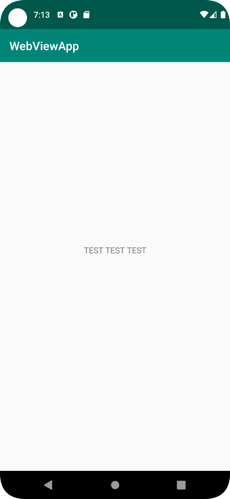

# Rapport

Jag har installerat git, Andriod studio och skapat ett gitHub konto.
Forkat hello från lenaSys enligt uppgfiten. Klonat till min laptop.
Ändrat i content_main.xml till en referens till @string/helloTest
I strings så la jag texten "TEST TEST TEST" som visas i appen
    <string name="helloTest">TEST TEST TEST</string>

    <TextView
        android:layout_width="wrap_content"
        android:layout_height="wrap_content"
        android:text="@string/helloTest"
        app:layout_constraintBottom_toBottomOf="parent"
        app:layout_constraintLeft_toLeftOf="parent"
        app:layout_constraintRight_toRightOf="parent"
        app:layout_constraintTop_toTopOf="parent" />

