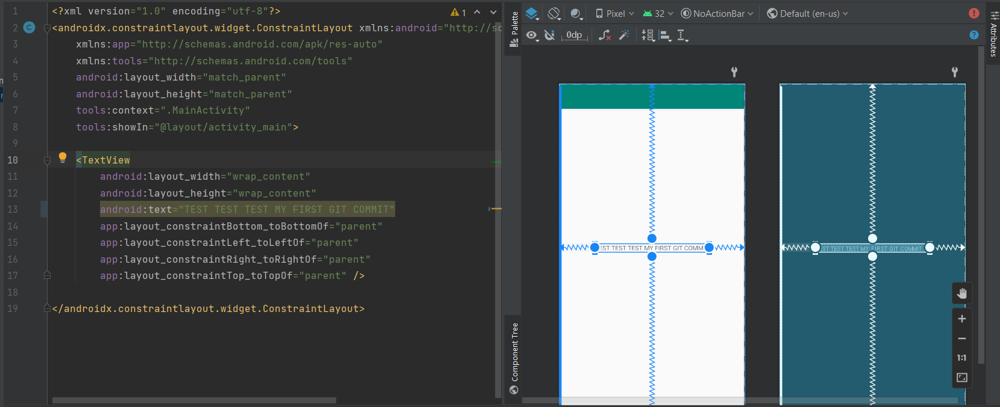

# Rapport

Jag har installerat git, Andriod studio och skapat ett gitHub konto.
Forkat hello från lenaSys enligt uppgfiten. Klonat till min laptop.
Ändrat "Hello World!" i content_main.xml till "TEST TEST TEST MY FIRST GIT COMMIT".
Och sist testat commit pch push.

    <TextView
        android:layout_width="wrap_content"
        android:layout_height="wrap_content"
        android:text="TEST TEST TEST MY FIRST GIT COMMIT"
        app:layout_constraintBottom_toBottomOf="parent"
        app:layout_constraintLeft_toLeftOf="parent"
        app:layout_constraintRight_toRightOf="parent"
        app:layout_constraintTop_toTopOf="parent" />

